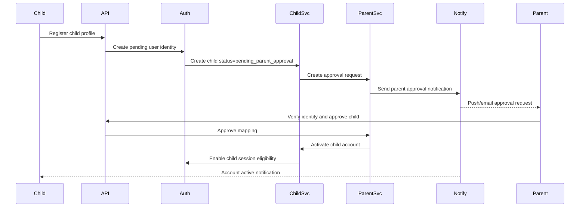
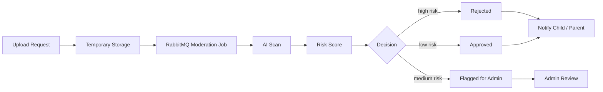
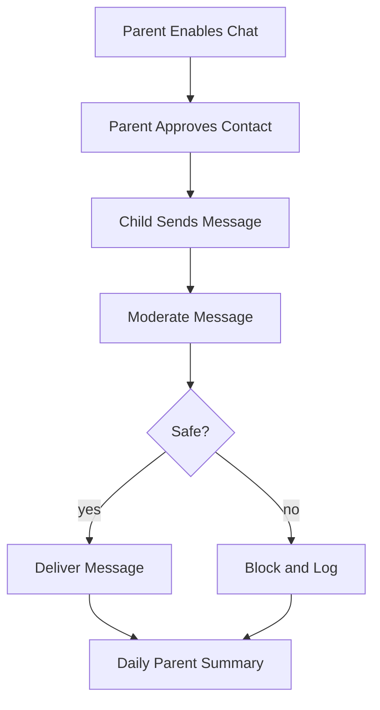
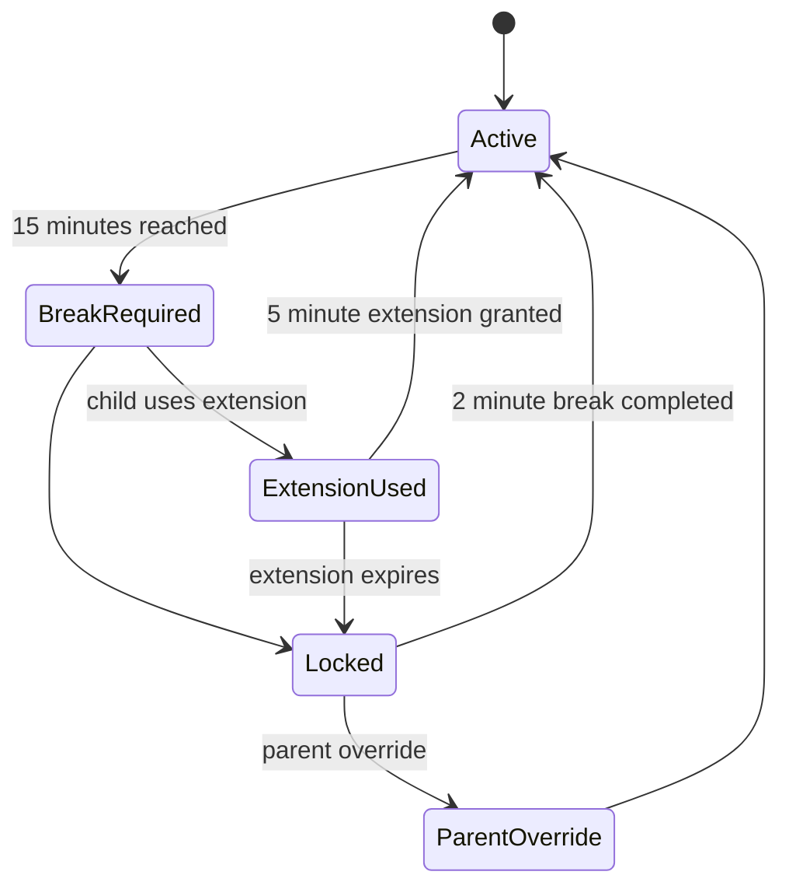
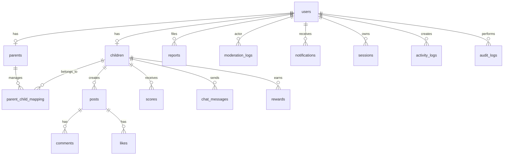
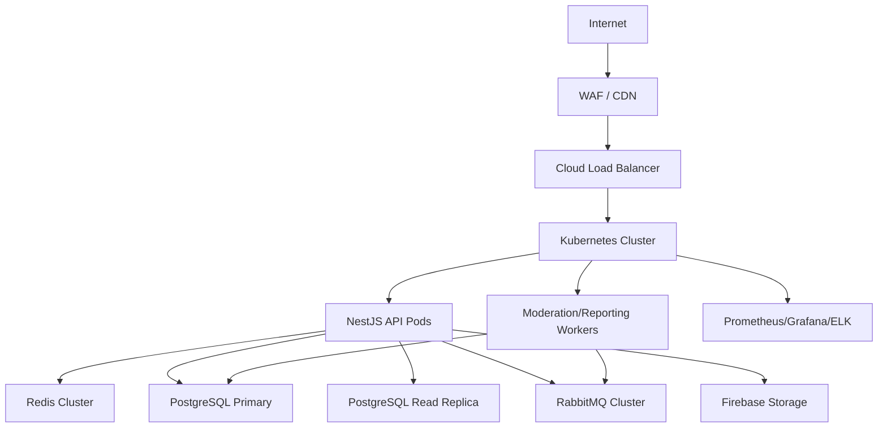

# KidsZone Phase 1 Architecture

## 1. Executive Summary

KidsZone is a child-safe educational social platform for children aged 5-15 with strict parental supervision, AI-assisted moderation, auditable safety controls, and scalable cloud architecture.

Primary goals:

- No child account becomes active without verified parent approval.
- All user-generated content is moderated before publication.
- Chat is disabled by default and limited to parent-approved contacts.
- Parent controls govern permissions, rewards, screen time, and reporting.
- Admins have auditable tools for review, suspension, configuration, and incident response.

Target scale:

- 1M+ registered users.
- 100K concurrent users.
- Horizontally scalable API, workers, queues, cache, and storage.

Core stack:

- Mobile: Flutter, Riverpod, Clean Architecture, Material 3.
- Backend: NestJS modular services.
- Database: PostgreSQL.
- Cache/session/rate-limits: Redis.
- Queue: RabbitMQ.
- Storage: Firebase Storage.
- Push: Firebase Cloud Messaging.
- Analytics: Firebase Analytics.
- Observability: Prometheus, Grafana, ELK.
- Optional search: Elasticsearch.

## 2. High-Level System Architecture

```mermaid
flowchart TB
    ChildApp["Flutter Child App"]
    ParentApp["Flutter Parent App"]
    AdminWeb["Admin Web Dashboard"]

    CDN["CDN / WAF"]
    Gateway["API Gateway / Load Balancer"]
    Auth["Authentication Service"]
    User["User Service"]
    Parent["Parent Service"]
    Child["Child Service"]
    Content["Content Service"]
    Moderation["Moderation Service"]
    Reward["Reward Service"]
    Notification["Notification Service"]
    Reporting["Reporting Service"]
    Admin["Admin Service"]

    Postgres[("PostgreSQL")]
    Redis[("Redis")]
    Rabbit[("RabbitMQ")]
    Storage[("Firebase Storage")]
    FCM["Firebase Cloud Messaging"]
    Analytics["Firebase Analytics"]
    OpenAI["OpenAI Moderation"]
    Perspective["Google Perspective API"]
    Vision["Google Vision SafeSearch"]
    Rekognition["AWS Rekognition Equivalent"]
    Elastic[("Elasticsearch Optional")]

    ChildApp --> CDN
    ParentApp --> CDN
    AdminWeb --> CDN
    CDN --> Gateway

    Gateway --> Auth
    Gateway --> User
    Gateway --> Parent
    Gateway --> Child
    Gateway --> Content
    Gateway --> Reward
    Gateway --> Reporting
    Gateway --> Admin

    Auth --> Postgres
    Auth --> Redis
    User --> Postgres
    Parent --> Postgres
    Child --> Postgres
    Content --> Postgres
    Content --> Storage
    Content --> Rabbit
    Moderation --> Rabbit
    Moderation --> Postgres
    Moderation --> OpenAI
    Moderation --> Perspective
    Moderation --> Vision
    Moderation --> Rekognition
    Reward --> Postgres
    Notification --> FCM
    Notification --> Rabbit
    Reporting --> Postgres
    Reporting --> Redis
    Admin --> Postgres
    Content --> Elastic
    User --> Analytics
```



## 3. Backend Service Boundaries

### Authentication Service

Responsibilities:

- Mobile OTP login.
- Email OTP login.
- Firebase Authentication integration.
- JWT access tokens.
- Refresh tokens.
- Session management.
- Device tracking.
- Token revocation.

Key rules:

- Access tokens are short-lived.
- Refresh tokens are rotating and hashed at rest.
- Child login is blocked until account status is `active`.

### User Service

Responsibilities:

- Base user records.
- Role assignment.
- Profile status.
- Soft deletion.
- Audit metadata.

Roles:

- `child`
- `parent`
- `admin`

### Parent Service

Responsibilities:

- Parent profile.
- Parent verification state.
- Parent-child approvals.
- Child permissions.
- Screen-time policy management.
- Reward budget settings.

### Child Service

Responsibilities:

- Child profile.
- Age-range policy enforcement.
- Account activation workflow.
- Permission checks.
- Suspension state.

### Content Service

Responsibilities:

- Posts, uploads, comments, likes, reactions.
- Pre-publication moderation state.
- Firebase Storage signed upload URLs.
- Content status transitions.

### Moderation Service

Responsibilities:

- Text, image, and video moderation.
- Risk score calculation.
- Local banned-word checks.
- Third-party moderation orchestration.
- Admin review queue.
- Moderation logs.

### Reward Service

Responsibilities:

- Virtual points.
- Badges.
- Parent-controlled monetary rewards.
- Configurable behavior scoring.
- Auto-suspension triggers.

### Notification Service

Responsibilities:

- FCM push notifications.
- Parent approvals.
- Daily reports.
- Safety alerts.
- Reward notifications.
- Learning reminders.

### Reporting Service

Responsibilities:

- Daily child activity summaries.
- Weekly parent reports.
- Learning trends.
- Usage trends.
- Behavior trends.

### Admin Service

Responsibilities:

- User management.
- Content review.
- Moderation queue.
- Reports.
- Suspensions.
- Reward settings.
- Feature toggles.
- Audit logs.

## 4. Core Workflows

### 4.1 Child Registration and Parent Approval



Rules:

- A child may register but cannot publish, chat, earn rewards, or access social features until parent approval.
- Parent identity verification must complete before approval.
- Approval actions are written to `audit_logs`.

### 4.2 Content Moderation Pipeline



Risk model:

- `0-24`: approve automatically.
- `25-59`: flag for admin review.
- `60-100`: reject automatically and alert parent when severe.

Every moderation decision stores:

- Provider results.
- Local rule hits.
- Risk score.
- Decision.
- Reviewer ID when human-reviewed.
- Immutable audit trail.

### 4.3 Chat Workflow

Default state:

- Chat disabled for every child.
- No public chat.
- No group chat.
- No stranger messaging.

Allowed flow:



### 4.4 Screen-Time Control

Rules:

- Track session start and session end.
- Lock screen after 15 minutes of continuous usage.
- Force a 2-minute break.
- Allow one 5-minute extension per day.
- Parent override can bypass the lock for a configured duration.

Implementation:

- Mobile app emits heartbeat every 60 seconds.
- Backend stores active session state in Redis and durable session records in PostgreSQL.
- API returns `screen_time_state` with every authenticated child response.
- Child app enforces lock UI locally.
- Backend rejects social/content actions while locked.

State machine:



## 5. Database Design

### 5.1 Entity Relationship Diagram



### 5.2 PostgreSQL Schema

```sql
CREATE EXTENSION IF NOT EXISTS "uuid-ossp";
CREATE EXTENSION IF NOT EXISTS "pgcrypto";

CREATE TYPE user_role AS ENUM ('child', 'parent', 'admin');
CREATE TYPE user_status AS ENUM ('pending', 'active', 'suspended', 'deleted');
CREATE TYPE child_status AS ENUM ('pending_parent_approval', 'active', 'suspended', 'rejected');
CREATE TYPE content_status AS ENUM ('pending', 'approved', 'rejected', 'flagged');
CREATE TYPE moderation_decision AS ENUM ('approved', 'flagged', 'rejected');
CREATE TYPE notification_status AS ENUM ('pending', 'sent', 'failed', 'read');
CREATE TYPE session_status AS ENUM ('active', 'ended', 'expired', 'revoked');
CREATE TYPE reward_type AS ENUM ('points', 'badge', 'monetary');
CREATE TYPE report_status AS ENUM ('open', 'in_review', 'resolved', 'dismissed');

CREATE TABLE users (
    id UUID PRIMARY KEY DEFAULT uuid_generate_v4(),
    firebase_uid VARCHAR(128) UNIQUE,
    role user_role NOT NULL,
    status user_status NOT NULL DEFAULT 'pending',
    email VARCHAR(255),
    phone VARCHAR(32),
    display_name VARCHAR(100) NOT NULL,
    avatar_url TEXT,
    email_verified BOOLEAN NOT NULL DEFAULT FALSE,
    phone_verified BOOLEAN NOT NULL DEFAULT FALSE,
    last_login_at TIMESTAMPTZ,
    created_at TIMESTAMPTZ NOT NULL DEFAULT NOW(),
    updated_at TIMESTAMPTZ NOT NULL DEFAULT NOW(),
    deleted_at TIMESTAMPTZ,
    created_by UUID REFERENCES users(id),
    updated_by UUID REFERENCES users(id),
    CONSTRAINT users_contact_required CHECK (email IS NOT NULL OR phone IS NOT NULL)
);

CREATE INDEX idx_users_role_status ON users(role, status) WHERE deleted_at IS NULL;
CREATE INDEX idx_users_email ON users(email) WHERE email IS NOT NULL AND deleted_at IS NULL;
CREATE INDEX idx_users_phone ON users(phone) WHERE phone IS NOT NULL AND deleted_at IS NULL;

CREATE TABLE parents (
    id UUID PRIMARY KEY DEFAULT uuid_generate_v4(),
    user_id UUID NOT NULL UNIQUE REFERENCES users(id),
    legal_name VARCHAR(150) NOT NULL,
    verification_status VARCHAR(32) NOT NULL DEFAULT 'unverified',
    verification_provider VARCHAR(64),
    verification_reference VARCHAR(128),
    reward_budget_cents INTEGER NOT NULL DEFAULT 0,
    daily_report_enabled BOOLEAN NOT NULL DEFAULT TRUE,
    weekly_report_enabled BOOLEAN NOT NULL DEFAULT TRUE,
    created_at TIMESTAMPTZ NOT NULL DEFAULT NOW(),
    updated_at TIMESTAMPTZ NOT NULL DEFAULT NOW(),
    deleted_at TIMESTAMPTZ
);

CREATE INDEX idx_parents_verification_status ON parents(verification_status) WHERE deleted_at IS NULL;

CREATE TABLE children (
    id UUID PRIMARY KEY DEFAULT uuid_generate_v4(),
    user_id UUID NOT NULL UNIQUE REFERENCES users(id),
    date_of_birth DATE NOT NULL,
    age_band VARCHAR(16) NOT NULL,
    status child_status NOT NULL DEFAULT 'pending_parent_approval',
    school_grade VARCHAR(32),
    chat_enabled BOOLEAN NOT NULL DEFAULT FALSE,
    content_upload_enabled BOOLEAN NOT NULL DEFAULT TRUE,
    daily_screen_limit_minutes INTEGER NOT NULL DEFAULT 60,
    continuous_usage_limit_minutes INTEGER NOT NULL DEFAULT 15,
    break_duration_minutes INTEGER NOT NULL DEFAULT 2,
    daily_extension_used_on DATE,
    suspended_until TIMESTAMPTZ,
    suspension_reason TEXT,
    created_at TIMESTAMPTZ NOT NULL DEFAULT NOW(),
    updated_at TIMESTAMPTZ NOT NULL DEFAULT NOW(),
    deleted_at TIMESTAMPTZ
);

CREATE INDEX idx_children_status ON children(status) WHERE deleted_at IS NULL;
CREATE INDEX idx_children_user_status ON children(user_id, status) WHERE deleted_at IS NULL;

CREATE TABLE parent_child_mapping (
    id UUID PRIMARY KEY DEFAULT uuid_generate_v4(),
    parent_id UUID NOT NULL REFERENCES parents(id),
    child_id UUID NOT NULL REFERENCES children(id),
    relationship VARCHAR(32) NOT NULL,
    approval_status VARCHAR(32) NOT NULL DEFAULT 'pending',
    approved_at TIMESTAMPTZ,
    permissions JSONB NOT NULL DEFAULT '{}',
    created_at TIMESTAMPTZ NOT NULL DEFAULT NOW(),
    updated_at TIMESTAMPTZ NOT NULL DEFAULT NOW(),
    deleted_at TIMESTAMPTZ,
    UNIQUE(parent_id, child_id)
);

CREATE INDEX idx_parent_child_parent ON parent_child_mapping(parent_id, approval_status) WHERE deleted_at IS NULL;
CREATE INDEX idx_parent_child_child ON parent_child_mapping(child_id, approval_status) WHERE deleted_at IS NULL;

CREATE TABLE posts (
    id UUID PRIMARY KEY DEFAULT uuid_generate_v4(),
    child_id UUID NOT NULL REFERENCES children(id),
    title VARCHAR(160) NOT NULL,
    body TEXT,
    media_type VARCHAR(32),
    media_url TEXT,
    storage_path TEXT,
    content_category VARCHAR(64) NOT NULL,
    status content_status NOT NULL DEFAULT 'pending',
    moderation_score INTEGER NOT NULL DEFAULT 0 CHECK (moderation_score BETWEEN 0 AND 100),
    published_at TIMESTAMPTZ,
    rejected_reason TEXT,
    created_at TIMESTAMPTZ NOT NULL DEFAULT NOW(),
    updated_at TIMESTAMPTZ NOT NULL DEFAULT NOW(),
    deleted_at TIMESTAMPTZ
);

CREATE INDEX idx_posts_child_status_created ON posts(child_id, status, created_at DESC) WHERE deleted_at IS NULL;
CREATE INDEX idx_posts_status_created ON posts(status, created_at DESC) WHERE deleted_at IS NULL;
CREATE INDEX idx_posts_category_status ON posts(content_category, status) WHERE deleted_at IS NULL;

CREATE TABLE comments (
    id UUID PRIMARY KEY DEFAULT uuid_generate_v4(),
    post_id UUID NOT NULL REFERENCES posts(id),
    child_id UUID NOT NULL REFERENCES children(id),
    body TEXT NOT NULL,
    status content_status NOT NULL DEFAULT 'pending',
    moderation_score INTEGER NOT NULL DEFAULT 0 CHECK (moderation_score BETWEEN 0 AND 100),
    published_at TIMESTAMPTZ,
    rejected_reason TEXT,
    created_at TIMESTAMPTZ NOT NULL DEFAULT NOW(),
    updated_at TIMESTAMPTZ NOT NULL DEFAULT NOW(),
    deleted_at TIMESTAMPTZ
);

CREATE INDEX idx_comments_post_status_created ON comments(post_id, status, created_at DESC) WHERE deleted_at IS NULL;
CREATE INDEX idx_comments_child_created ON comments(child_id, created_at DESC) WHERE deleted_at IS NULL;

CREATE TABLE likes (
    id UUID PRIMARY KEY DEFAULT uuid_generate_v4(),
    post_id UUID NOT NULL REFERENCES posts(id),
    child_id UUID NOT NULL REFERENCES children(id),
    reaction_type VARCHAR(32) NOT NULL DEFAULT 'like',
    created_at TIMESTAMPTZ NOT NULL DEFAULT NOW(),
    deleted_at TIMESTAMPTZ,
    UNIQUE(post_id, child_id, reaction_type)
);

CREATE INDEX idx_likes_post ON likes(post_id) WHERE deleted_at IS NULL;
CREATE INDEX idx_likes_child ON likes(child_id) WHERE deleted_at IS NULL;

CREATE TABLE reports (
    id UUID PRIMARY KEY DEFAULT uuid_generate_v4(),
    reporter_user_id UUID NOT NULL REFERENCES users(id),
    target_type VARCHAR(32) NOT NULL,
    target_id UUID NOT NULL,
    reason VARCHAR(128) NOT NULL,
    description TEXT,
    status report_status NOT NULL DEFAULT 'open',
    assigned_admin_id UUID REFERENCES users(id),
    resolved_at TIMESTAMPTZ,
    resolution_notes TEXT,
    created_at TIMESTAMPTZ NOT NULL DEFAULT NOW(),
    updated_at TIMESTAMPTZ NOT NULL DEFAULT NOW(),
    deleted_at TIMESTAMPTZ
);

CREATE INDEX idx_reports_status_created ON reports(status, created_at DESC) WHERE deleted_at IS NULL;
CREATE INDEX idx_reports_target ON reports(target_type, target_id) WHERE deleted_at IS NULL;

CREATE TABLE scores (
    id UUID PRIMARY KEY DEFAULT uuid_generate_v4(),
    child_id UUID NOT NULL REFERENCES children(id),
    good_score INTEGER NOT NULL DEFAULT 0,
    bad_score INTEGER NOT NULL DEFAULT 0,
    score_delta INTEGER NOT NULL,
    event_type VARCHAR(64) NOT NULL,
    event_reference_type VARCHAR(32),
    event_reference_id UUID,
    notes TEXT,
    created_at TIMESTAMPTZ NOT NULL DEFAULT NOW()
);

CREATE INDEX idx_scores_child_created ON scores(child_id, created_at DESC);
CREATE INDEX idx_scores_event_type ON scores(event_type, created_at DESC);

CREATE TABLE moderation_logs (
    id UUID PRIMARY KEY DEFAULT uuid_generate_v4(),
    target_type VARCHAR(32) NOT NULL,
    target_id UUID NOT NULL,
    actor_user_id UUID REFERENCES users(id),
    provider VARCHAR(64) NOT NULL,
    provider_reference VARCHAR(128),
    raw_result JSONB NOT NULL DEFAULT '{}',
    risk_score INTEGER NOT NULL CHECK (risk_score BETWEEN 0 AND 100),
    decision moderation_decision NOT NULL,
    reason_codes TEXT[] NOT NULL DEFAULT '{}',
    reviewed_by UUID REFERENCES users(id),
    reviewed_at TIMESTAMPTZ,
    created_at TIMESTAMPTZ NOT NULL DEFAULT NOW()
);

CREATE INDEX idx_moderation_target ON moderation_logs(target_type, target_id);
CREATE INDEX idx_moderation_decision_created ON moderation_logs(decision, created_at DESC);
CREATE INDEX idx_moderation_risk_score ON moderation_logs(risk_score DESC);

CREATE TABLE notifications (
    id UUID PRIMARY KEY DEFAULT uuid_generate_v4(),
    user_id UUID NOT NULL REFERENCES users(id),
    type VARCHAR(64) NOT NULL,
    title VARCHAR(160) NOT NULL,
    body TEXT NOT NULL,
    data JSONB NOT NULL DEFAULT '{}',
    status notification_status NOT NULL DEFAULT 'pending',
    sent_at TIMESTAMPTZ,
    read_at TIMESTAMPTZ,
    created_at TIMESTAMPTZ NOT NULL DEFAULT NOW(),
    deleted_at TIMESTAMPTZ
);

CREATE INDEX idx_notifications_user_status_created ON notifications(user_id, status, created_at DESC) WHERE deleted_at IS NULL;

CREATE TABLE sessions (
    id UUID PRIMARY KEY DEFAULT uuid_generate_v4(),
    user_id UUID NOT NULL REFERENCES users(id),
    device_id VARCHAR(128) NOT NULL,
    refresh_token_hash TEXT NOT NULL,
    ip_address INET,
    user_agent TEXT,
    status session_status NOT NULL DEFAULT 'active',
    started_at TIMESTAMPTZ NOT NULL DEFAULT NOW(),
    last_seen_at TIMESTAMPTZ NOT NULL DEFAULT NOW(),
    ended_at TIMESTAMPTZ,
    expires_at TIMESTAMPTZ NOT NULL,
    revoked_at TIMESTAMPTZ,
    revoked_reason TEXT,
    created_at TIMESTAMPTZ NOT NULL DEFAULT NOW()
);

CREATE INDEX idx_sessions_user_status ON sessions(user_id, status);
CREATE INDEX idx_sessions_device ON sessions(device_id, status);
CREATE INDEX idx_sessions_expires ON sessions(expires_at);

CREATE TABLE chat_messages (
    id UUID PRIMARY KEY DEFAULT uuid_generate_v4(),
    sender_child_id UUID NOT NULL REFERENCES children(id),
    recipient_child_id UUID NOT NULL REFERENCES children(id),
    body TEXT NOT NULL,
    status content_status NOT NULL DEFAULT 'pending',
    moderation_score INTEGER NOT NULL DEFAULT 0 CHECK (moderation_score BETWEEN 0 AND 100),
    delivered_at TIMESTAMPTZ,
    read_at TIMESTAMPTZ,
    rejected_reason TEXT,
    created_at TIMESTAMPTZ NOT NULL DEFAULT NOW(),
    deleted_at TIMESTAMPTZ,
    CONSTRAINT no_self_chat CHECK (sender_child_id <> recipient_child_id)
);

CREATE INDEX idx_chat_sender_created ON chat_messages(sender_child_id, created_at DESC) WHERE deleted_at IS NULL;
CREATE INDEX idx_chat_recipient_created ON chat_messages(recipient_child_id, created_at DESC) WHERE deleted_at IS NULL;
CREATE INDEX idx_chat_status_created ON chat_messages(status, created_at DESC) WHERE deleted_at IS NULL;

CREATE TABLE rewards (
    id UUID PRIMARY KEY DEFAULT uuid_generate_v4(),
    child_id UUID NOT NULL REFERENCES children(id),
    parent_id UUID REFERENCES parents(id),
    reward_type reward_type NOT NULL,
    name VARCHAR(120) NOT NULL,
    description TEXT,
    points INTEGER NOT NULL DEFAULT 0,
    monetary_amount_cents INTEGER NOT NULL DEFAULT 0,
    approved_by_parent BOOLEAN NOT NULL DEFAULT FALSE,
    awarded_at TIMESTAMPTZ,
    redeemed_at TIMESTAMPTZ,
    created_at TIMESTAMPTZ NOT NULL DEFAULT NOW(),
    updated_at TIMESTAMPTZ NOT NULL DEFAULT NOW(),
    deleted_at TIMESTAMPTZ
);

CREATE INDEX idx_rewards_child_type_created ON rewards(child_id, reward_type, created_at DESC) WHERE deleted_at IS NULL;
CREATE INDEX idx_rewards_parent_created ON rewards(parent_id, created_at DESC) WHERE deleted_at IS NULL;

CREATE TABLE activity_logs (
    id UUID PRIMARY KEY DEFAULT uuid_generate_v4(),
    user_id UUID NOT NULL REFERENCES users(id),
    child_id UUID REFERENCES children(id),
    activity_type VARCHAR(64) NOT NULL,
    metadata JSONB NOT NULL DEFAULT '{}',
    ip_address INET,
    device_id VARCHAR(128),
    created_at TIMESTAMPTZ NOT NULL DEFAULT NOW()
);

CREATE INDEX idx_activity_user_created ON activity_logs(user_id, created_at DESC);
CREATE INDEX idx_activity_child_created ON activity_logs(child_id, created_at DESC) WHERE child_id IS NOT NULL;
CREATE INDEX idx_activity_type_created ON activity_logs(activity_type, created_at DESC);

CREATE TABLE audit_logs (
    id UUID PRIMARY KEY DEFAULT uuid_generate_v4(),
    actor_user_id UUID REFERENCES users(id),
    action VARCHAR(96) NOT NULL,
    target_type VARCHAR(32) NOT NULL,
    target_id UUID,
    before_state JSONB,
    after_state JSONB,
    ip_address INET,
    user_agent TEXT,
    created_at TIMESTAMPTZ NOT NULL DEFAULT NOW()
);

CREATE INDEX idx_audit_actor_created ON audit_logs(actor_user_id, created_at DESC);
CREATE INDEX idx_audit_target_created ON audit_logs(target_type, target_id, created_at DESC);
CREATE INDEX idx_audit_action_created ON audit_logs(action, created_at DESC);
```

### 5.3 Additional Recommended Tables for Phase 2

The requested table list is sufficient for the core model, but production implementation should also include:

- `devices`
- `otp_challenges`
- `refresh_token_rotations`
- `child_contact_approvals`
- `screen_time_events`
- `feature_toggles`
- `reward_rules`
- `admin_review_tasks`
- `educational_content`
- `weekly_reports`
- `daily_reports`

## 6. API Design

Base path:

```text
/api/v1
```

Authentication:

```http
Authorization: Bearer <access_token>
```

Common response envelope:

```json
{
  "success": true,
  "data": {},
  "meta": {
    "requestId": "req_123",
    "timestamp": "2026-06-02T00:00:00.000Z"
  }
}
```

Common error envelope:

```json
{
  "success": false,
  "error": {
    "code": "CHILD_ACCOUNT_PENDING_APPROVAL",
    "message": "Child account requires parent approval before access.",
    "details": {}
  },
  "meta": {
    "requestId": "req_123",
    "timestamp": "2026-06-02T00:00:00.000Z"
  }
}
```

### 6.1 Authentication APIs

| Method | Endpoint | Roles | Purpose |
|---|---|---|---|
| POST | `/auth/otp/mobile/request` | Public | Request mobile OTP |
| POST | `/auth/otp/mobile/verify` | Public | Verify mobile OTP |
| POST | `/auth/otp/email/request` | Public | Request email OTP |
| POST | `/auth/otp/email/verify` | Public | Verify email OTP |
| POST | `/auth/refresh` | Authenticated | Rotate refresh token |
| POST | `/auth/logout` | Authenticated | Revoke current session |
| POST | `/auth/logout-all` | Authenticated | Revoke all sessions |
| GET | `/auth/sessions` | Parent/Admin/User | List active sessions |

Example request:

```json
{
  "phone": "+15551234567",
  "deviceId": "ios-device-123"
}
```

### 6.2 Child Registration APIs

| Method | Endpoint | Roles | Purpose |
|---|---|---|---|
| POST | `/children/register` | Public | Create pending child account |
| GET | `/children/me` | Child | Get child profile |
| PATCH | `/children/me` | Child | Update allowed profile fields |
| POST | `/children/:childId/screen-time/heartbeat` | Child | Track session heartbeat |
| GET | `/children/:childId/screen-time/state` | Child/Parent/Admin | Read screen-time state |

### 6.3 Parent APIs

| Method | Endpoint | Roles | Purpose |
|---|---|---|---|
| POST | `/parents/register` | Public | Create parent account |
| POST | `/parents/verify-identity` | Parent | Start or complete verification |
| GET | `/parents/me/children` | Parent | List children |
| GET | `/parents/approvals` | Parent | List pending approvals |
| POST | `/parents/approvals/:requestId/approve` | Parent | Approve child |
| POST | `/parents/approvals/:requestId/reject` | Parent | Reject child |
| PATCH | `/parents/children/:childId/permissions` | Parent | Update permissions |
| PATCH | `/parents/children/:childId/screen-time` | Parent | Update screen-time rules |
| POST | `/parents/children/:childId/suspend` | Parent | Suspend child access |
| POST | `/parents/children/:childId/override-lock` | Parent | Override screen-time lock |

### 6.4 Content APIs

| Method | Endpoint | Roles | Purpose |
|---|---|---|---|
| POST | `/posts/upload-url` | Child | Create signed upload URL |
| POST | `/posts` | Child | Submit post for moderation |
| GET | `/posts/feed` | Child/Parent/Admin | Read approved feed |
| GET | `/posts/:postId` | Child/Parent/Admin | Read approved post or owned pending post |
| PATCH | `/posts/:postId` | Child | Edit owned pending/rejected post |
| DELETE | `/posts/:postId` | Child/Parent/Admin | Soft-delete post |
| POST | `/posts/:postId/comments` | Child | Submit moderated comment |
| POST | `/posts/:postId/likes` | Child | Like/react to post |
| DELETE | `/posts/:postId/likes` | Child | Remove reaction |

### 6.5 Chat APIs

| Method | Endpoint | Roles | Purpose |
|---|---|---|---|
| GET | `/chat/contacts` | Child | List approved contacts |
| POST | `/chat/messages` | Child | Send moderated message |
| GET | `/chat/messages` | Child | List messages |
| PATCH | `/chat/messages/:messageId/read` | Child | Mark message read |
| GET | `/parents/children/:childId/chat-summary` | Parent | Read daily chat summary |

### 6.6 Reward APIs

| Method | Endpoint | Roles | Purpose |
|---|---|---|---|
| GET | `/children/:childId/rewards` | Child/Parent | List rewards |
| POST | `/parents/children/:childId/rewards` | Parent | Grant parent reward |
| PATCH | `/parents/reward-budget` | Parent | Set monetary reward budget |
| GET | `/children/:childId/scores` | Child/Parent/Admin | Get reputation scores |

### 6.7 Reporting APIs

| Method | Endpoint | Roles | Purpose |
|---|---|---|---|
| POST | `/reports` | Child/Parent | Report content/user |
| GET | `/parents/children/:childId/reports/daily` | Parent | Daily activity report |
| GET | `/parents/children/:childId/reports/weekly` | Parent | Weekly activity report |
| GET | `/parents/children/:childId/analytics` | Parent | Usage, learning, behavior trends |

### 6.8 Admin APIs

| Method | Endpoint | Roles | Purpose |
|---|---|---|---|
| GET | `/admin/users` | Admin | User management |
| PATCH | `/admin/users/:userId/status` | Admin | Suspend/reactivate user |
| GET | `/admin/content/review-queue` | Admin | Content review queue |
| POST | `/admin/content/:contentId/approve` | Admin | Approve flagged content |
| POST | `/admin/content/:contentId/reject` | Admin | Reject flagged content |
| GET | `/admin/moderation/logs` | Admin | Moderation logs |
| GET | `/admin/reports` | Admin | User reports |
| PATCH | `/admin/reward-rules` | Admin | Configure scoring rules |
| PATCH | `/admin/feature-toggles/:key` | Admin | Toggle features |
| GET | `/admin/audit-logs` | Admin | Audit trail |

## 7. Security Architecture

### 7.1 Security Principles

- Privacy by design.
- Child safety first.
- Least privilege.
- Defense in depth.
- Full auditability of sensitive actions.
- No unmoderated child-generated public content.
- No child account activation without parent approval.

### 7.2 Authentication and Authorization

Controls:

- Firebase Authentication for identity verification.
- JWT access tokens with short expiry.
- Rotating refresh tokens stored as hashes.
- Device-bound sessions.
- Session revocation.
- RBAC guards for `child`, `parent`, and `admin`.
- Resource ownership guards for parent-child mappings.
- Step-up verification for high-risk parent/admin actions.

JWT claims:

```json
{
  "sub": "user_uuid",
  "role": "parent",
  "sessionId": "session_uuid",
  "deviceId": "device_uuid",
  "iat": 1780358400,
  "exp": 1780359300
}
```

### 7.3 COPPA-Oriented Safeguards

Required implementation controls:

- Verifiable parental consent before child activation.
- Parent access to child activity and stored profile data.
- Parent ability to suspend or delete child account.
- Data minimization for children.
- No behavioral advertising targeted at children.
- Clear retention policy for child data.
- Moderation and review records for safety incidents.
- Age-appropriate UX and privacy defaults.

Legal note:

- COPPA compliance requires legal review, policy publication, consent method validation, and operational procedures beyond code.

### 7.4 Data Protection

At rest:

- PostgreSQL disk encryption.
- Encrypted backups.
- Hashed refresh tokens.
- Secrets stored in a cloud secret manager.
- Sensitive provider payloads minimized or redacted.

In transit:

- TLS 1.2+ everywhere.
- HSTS at edge.
- Certificate rotation.
- Service-to-service mTLS in Kubernetes where possible.

Application:

- DTO validation with `class-validator`.
- Output serialization with explicit DTOs.
- HTML sanitization for displayable text.
- Parameterized queries through ORM/query builder.
- File type validation by MIME and magic bytes.
- Antivirus/malware scanning for uploads where supported.

### 7.5 API Abuse Protection

Controls:

- Redis-backed rate limiting.
- OTP request throttling.
- Login anomaly detection.
- IP and device reputation checks.
- Admin endpoint stricter throttling.
- Upload size limits.
- Queue backpressure.
- WAF rules for common attack patterns.

### 7.6 Threat Model

| Threat | Risk | Mitigation |
|---|---|---|
| Child bypasses parent approval | High | Account status checks in auth guard and service layer |
| Stranger contacts child | Critical | Chat disabled by default, approved contacts only |
| Unsafe content published | Critical | Pre-publication moderation and admin queue |
| Toxic chat message delivered | Critical | Message-level moderation before delivery |
| Parent account takeover | High | OTP throttling, device tracking, session revocation, step-up verification |
| Admin abuse | High | RBAC, audit logs, least privilege, review workflows |
| SQL injection | High | Parameterized queries, validation, ORM safeguards |
| XSS | High | Sanitization, output encoding, CSP |
| CSRF | Medium | SameSite cookies if cookies are used, CSRF tokens for web admin |
| Token theft | High | Short access-token TTL, rotating refresh tokens, revoke sessions |
| Upload malware or disguised media | High | Magic-byte checks, size limits, scanning, isolated processing |
| Moderation provider outage | High | Queue retry, fallback providers, conservative fail-closed behavior |
| Data breach | Critical | Encryption, minimization, audit, secret management, least privilege |
| Excessive screen time | Medium | Server-side state and app-side lock enforcement |

## 8. Moderation Architecture

### 8.1 Text Moderation

Providers:

- OpenAI Moderation.
- Google Perspective API.
- Local banned-word engine.

Signals:

- Abuse.
- Bullying.
- Harassment.
- Threats.
- Hate speech.
- Adult language.

Decision algorithm:

```text
local_score = banned_word_weight + phrase_pattern_weight
openai_score = provider_category_confidence * provider_weight
perspective_score = toxicity_score * provider_weight
final_score = max(local_score, weighted_average(openai_score, perspective_score, local_score))

if final_score >= 60:
    reject
elif final_score >= 25:
    flag_for_admin
else:
    approve
```

### 8.2 Image Moderation

Providers:

- Google Vision SafeSearch.
- AWS Rekognition equivalent.

Signals:

- Nudity.
- Violence.
- Drugs.
- Weapons.
- Visually disturbing content.

Rules:

- High-confidence unsafe result rejects automatically.
- Medium-confidence result goes to admin queue.
- Low-confidence result can be approved if no other signals are present.

### 8.3 Video Moderation

Pipeline:

- Upload to temporary quarantine storage.
- Extract frames at fixed intervals.
- Scan captions, title, description, and metadata.
- Moderate representative frames.
- Reject on any critical frame.
- Flag on repeated medium-risk frames.
- Move approved video to public approved storage path.

## 9. Behavior and Reputation Engine

Each child has:

- Good score.
- Bad score.
- Event-based score history.

Positive events:

| Event | Good Score |
|---|---:|
| Quiz completed | +10 |
| Learning challenge completed | +15 |
| Daily learning streak | +5 |
| Approved educational project | +20 |
| Good comment approved | +3 |

Negative events:

| Event | Bad Score |
|---|---:|
| Toxic comment rejected | +10 |
| Unsafe upload rejected | +20 |
| Severe moderation violation | +40 |
| Confirmed report | +25 |
| Chat safety violation | +15 |

Suspension algorithm:

```text
net_health = good_score - bad_score

if severe_violation_count >= 2 in 30 days:
    suspend for 7 days
elif bad_score >= 100 and net_health < -30:
    suspend for 7 days
elif confirmed_safety_report_count >= 3 in 30 days:
    suspend for 7 days
else:
    continue monitoring
```

Admin configuration:

- Event weights.
- Suspension thresholds.
- Decay period.
- Manual overrides.
- Parent notification thresholds.

Recommended score decay:

- Good score persists for motivation.
- Bad score decays by 10% every 30 days without violations.
- Severe violations do not fully decay and remain visible to parent/admin reports.

## 10. Performance and Scaling Strategy

### 10.1 Horizontal Scaling

- Stateless NestJS services behind load balancer.
- Kubernetes HPA based on CPU, memory, request latency, and queue depth.
- RabbitMQ worker autoscaling for moderation and reporting jobs.
- Redis cluster for cache, rate limits, and active screen-time sessions.
- PostgreSQL read replicas for reporting and feeds.

### 10.2 Caching

Redis cache targets:

- User profile summary.
- Parent-child permissions.
- Screen-time active state.
- Feed page IDs.
- Feature toggles.
- Rate-limit counters.

Cache invalidation:

- Write-through for permissions and feature toggles.
- Short TTL for feeds.
- Explicit invalidation on parent permission changes.

### 10.3 Database Scaling

Indexes:

- Composite indexes on status, owner ID, and created date.
- Partial indexes excluding soft-deleted rows.
- Dedicated reporting read replica.

Partitioning candidates:

- `activity_logs` by month.
- `audit_logs` by month.
- `moderation_logs` by month.
- `chat_messages` by month.

### 10.4 CDN and Storage

- Approved media served through CDN.
- Pending media stays in private quarantine path.
- Rejected media deleted or retained only according to safety/legal retention policy.
- Signed URLs expire quickly.

## 11. Admin UI Wireframes

### 11.1 Admin Dashboard

```text
+------------------------------------------------------+
| Top Bar: Search | Alerts | Admin Profile             |
+-------------------+----------------------------------+
| Sidebar           | Safety Overview                  |
| - Users           | Pending Reviews: 128             |
| - Parents         | High Risk Flags: 12              |
| - Children        | Open Reports: 34                 |
| - Content Review  | Suspensions Today: 5             |
| - Moderation      |                                  |
| - Reports         | Review Queue Table               |
| - Rewards         | [Type] [Risk] [Age] [Created]    |
| - Toggles         |                                  |
| - Audit Logs      |                                  |
+-------------------+----------------------------------+
```

### 11.2 Content Review

```text
+------------------------------------------------------+
| Content Review Queue                                 |
+----------------------+-------------------------------+
| Filters              | Selected Item                  |
| Status               | Preview                        |
| Risk Score           | Child Age Band                 |
| Content Type         | Moderation Signals             |
| Date Range           | Provider Results               |
|                      | Actions: Approve Reject Escalate|
+----------------------+-------------------------------+
```

### 11.3 Child Safety Profile

```text
+------------------------------------------------------+
| Child Profile | Status | Parent Links | Actions      |
+------------------------------------------------------+
| Activity Trend        | Score History                 |
| Screen Time           | Recent Moderation Events      |
| Reports               | Rewards                       |
+------------------------------------------------------+
```

## 12. Deployment Architecture



Environments:

- `local`
- `development`
- `staging`
- `production`

Release strategy:

- CI runs lint, tests, security checks, and image build.
- CD deploys to staging first.
- Production uses rolling deployment or canary deployment.
- Database migrations run with preflight validation and rollback plan.

## 13. Phase 1 Approval Checklist

Phase 1 is ready for approval when these are accepted:

- System service boundaries.
- Parent approval model.
- Moderation pipeline.
- PostgreSQL schema direction.
- API resource model.
- Security architecture.
- COPPA-oriented safeguards.
- Scaling strategy.
- Admin dashboard scope.

After approval, Phase 2 should generate the NestJS backend implementation:

- Modules.
- DTOs.
- Entities.
- Repositories.
- Services.
- Controllers.
- Guards.
- Middleware.
- Interceptors.
- Tests.
